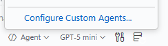

# STEPS

## Step 1: Configure Custom Agent

**Purpose:** The user must add a CUSTOM Agent in the .github/agents folder to improve development.  
**Guidance:** The user should follow the Configure Custom Agent wizard inside VS Code to add a new Agent.  
**AI Feature(s):** AGENT mode / CUSTOM AGENT  
**Model:** N/A

### Execution

Follow the instructions below to configure the custom agent.

**Prompt Example:**
*No prompt example provided.*

### GUIDE FILE

Select the Configure Custom Agent in the Agent Picker Menu


Follow the Menu wizard at the top of your screen


Give the agent instructions related to being a developer.

Example:

```markdown

You are an EXPERT developer, and always make sure to build and validate the application after making adjustments
```

### Review Checks

- Make sure a developer agent is created
- Make sure the agent has good developer instructions

---

## Step 2: Initialize "HelloForge"

**Purpose:** Create a .NET console application that prints "Hello World."  
**Guidance:** The user should use their created Developer AGENT in Github Copilot to instruct the agent to create a new .NET10 Console App  in /src using dotnet cli.  
**AI Feature(s):** Custom Agent
**Model:** `GPT-5-mini` (Required)

### Execution

Instruct the Developer Agent to create the project in the `/src` directory.

**Prompt Example:**
> Create a new .NET 10 Console App in /src which returns Hello World. Call the app HelloForge. Use dotnet cli commands.

### GUIDE FILE

### Review Checks

- Make sure the `/src/HelloForge/` directory was created
- Make sure `HelloForge.csproj` and `Program.cs` exist
- Make sure the app builds and prints "Hello World"

---

## Step 3: Personalized Greeting

**Purpose:** Add a new feature where the user is prompted to enter their name, and adjust the output to be Hello World {UserName}.  
**Guidance:** The user should use their created Developer AGENT to instruct the agent to make the needed adjustments.  
**AI Feature(s):** Custom Agent
**Model:** `GPT-5-mini` (Required)

### Execution

Instruct the Copilot Agent to modify the application to accept user input.

**Prompt Example:** // AI should not propose and example prompt
*Try crafting your own prompt for this!*

### GUIDE FILE

### Review Checks

- Make sure the app prompts the user for their name
- Make sure the output reads "Hello World {UserName}"
- Make sure the app builds and runs successfully

---
